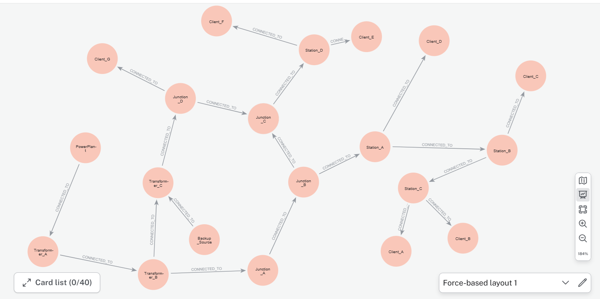
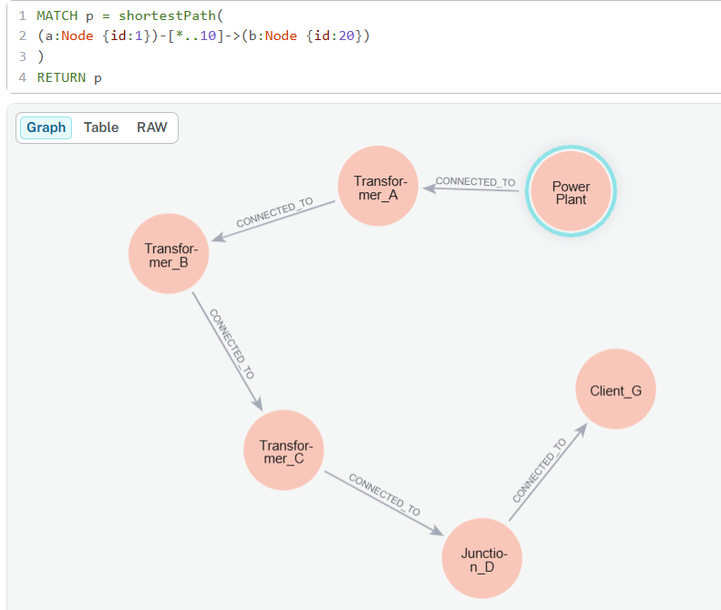
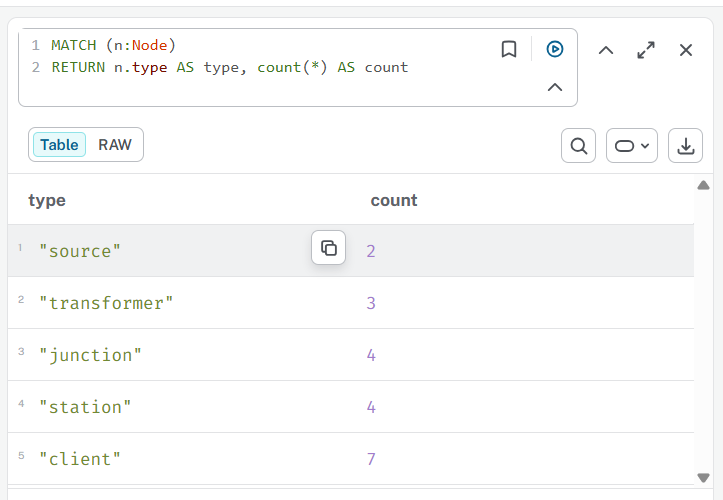
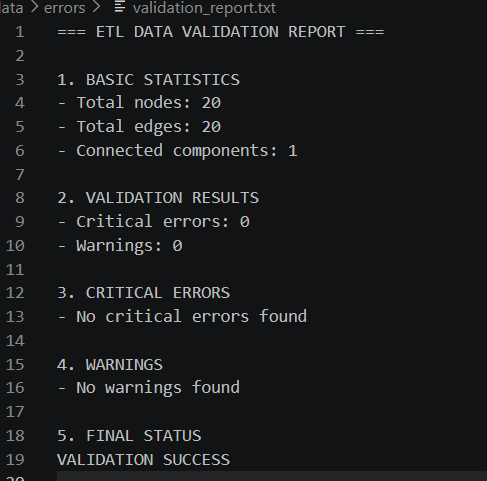

# ETL Graph Infrastructure Project

## Overview

This project presents a complete ETL (Extract, Transform, Load) pipeline for transforming infrastructure network data into a graph-based model using Neo4j.

The main goal of the project is to validate, clean, transform, and analyze infrastructure data represented as nodes and edges. The processed data is then imported into a Neo4j graph database for graph analytics and visualization.

The project was developed as part of a Data Warehousing and Data Processing course.

---

## Architecture

```text
CSV / GIS Data
        ↓
Python ETL Pipeline
        ↓
Data Validation
        ↓
Data Transformation
        ↓
Neo4j Graph Database
        ↓
Graph Analytics & Visualization
```

---

## Technology Stack

- Python
- pandas
- networkx
- Neo4j
- Cypher Query Language

---

## Project Structure

```text
etlstart/
│
├── data/
│   ├── raw/
│   ├── processed/
│   └── errors/
│
├── docs/
│   └── screenshots/
│
├── neo4j/
│   └── queries.cypher
│
├── src/
│   ├── etl.py
│   ├── transform.py
│   └── load_neo4j.py
│
├── requirements.txt
└── README.md
```

---

## ETL Pipeline

### 1. Extract

Raw infrastructure data is loaded from CSV files:

- `nodes.csv`
- `edges.csv`

---

### 2. Transform

The transformation stage includes:

- duplicate removal
- referential integrity validation
- graph consistency checks
- invalid edge removal
- isolated node detection
- data normalization for Neo4j import

Processed datasets are exported as:

- `processed_nodes.csv`
- `processed_edges.csv`

---

### 3. Load

The cleaned and transformed data is imported into Neo4j as:

- graph nodes
- graph relationships

---

## Data Validation

The project performs multiple validation checks:

- missing values detection
- duplicated node validation
- duplicated edge validation
- invalid source/target detection
- isolated node detection
- graph connectivity analysis
- node type validation
- status validation
- edge length validation

Validation results are saved to:

```text
data/errors/validation_report.txt
```

---

## Neo4j Graph Model

### Node Properties

| Property | Description |
|---|---|
| id | Unique node identifier |
| name | Node name |
| type | Infrastructure type |
| x | Longitude |
| y | Latitude |
| status | Node status |

---

### Relationship Properties

| Property | Description |
|---|---|
| type | Connection type |
| length | Edge length |
| status | Connection status |

---

## Example Graph Queries

### Graph Overview

```cypher
MATCH (a)-[r]->(b)
RETURN a,r,b
LIMIT 50
```

---

### Shortest Path

```cypher
MATCH p = shortestPath(
(a:Node {id:1})-[*..10]->(b:Node {id:20})
)
RETURN p
```

---

### Most Connected Nodes

```cypher
MATCH (n:Node)--()
RETURN n.name AS node,
       count(*) AS degree
ORDER BY degree DESC
```

---

## Screenshots

### Graph Overview



---

### Shortest Path Analysis



---

### Node Type Statistics



---

### Validation Report



---

## How To Run

### Install dependencies

```bash
pip install -r requirements.txt
```

---

### Run ETL validation

```bash
python src/etl.py
```

---

### Run transformation pipeline

```bash
python src/transform.py
```

---

### Import processed CSV files into Neo4j

Use queries from:

```text
neo4j/queries.cypher
```

---

## Future Improvements

- GIS integration with PostGIS
- Interactive graph visualization with PyVis
- FastAPI REST API
- Docker support
- Advanced graph analytics
- Automatic validation reports in JSON format

---

## Author

Project created for educational and portfolio purposes.
